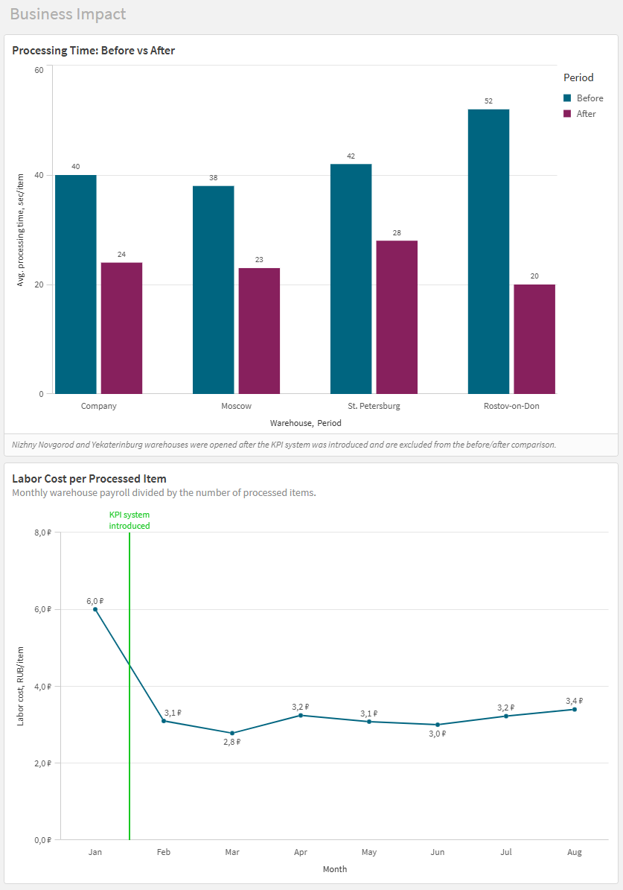
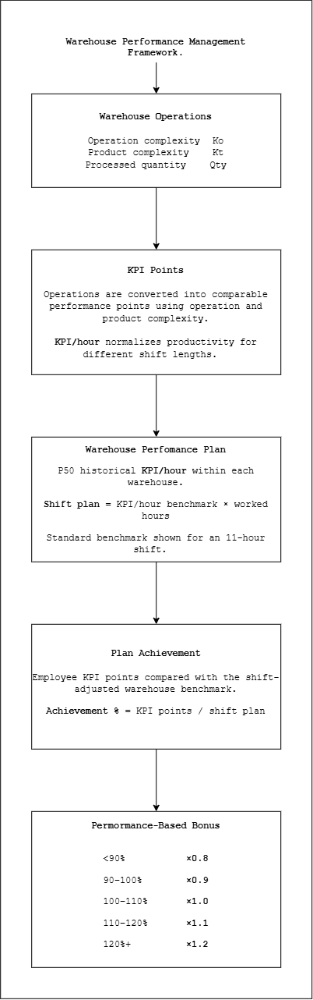
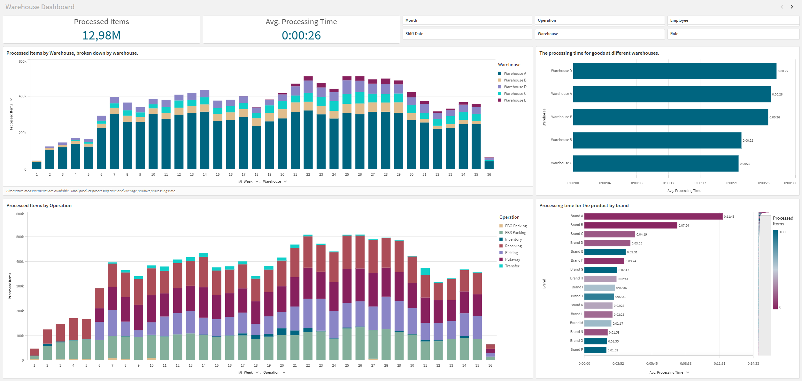
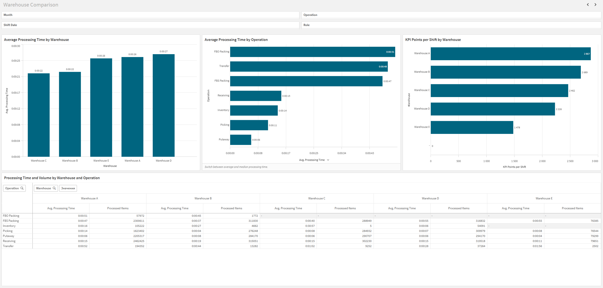

# Warehouse Performance Management

A data-driven warehouse performance management system that connects operational activity, employee incentives, warehouse benchmarking, and productivity analytics.

The project started as a redesign of warehouse employee compensation and evolved into a broader analytics system for measuring operational efficiency and identifying productivity improvement opportunities.

## Business Problem

Warehouse employees received largely similar bonuses regardless of their individual performance.

Although a shift-level performance target formally existed, individual productivity was not systematically measured and bonuses were effectively distributed without a consistent data-driven framework.

This created two problems:

- low-performing employees had little incentive to improve;
- high-performing employees had little reason to increase productivity because additional effort was not meaningfully rewarded.

The CEO initiated a project to introduce a transparent performance-based incentive system.

As operational data accumulated, the project expanded beyond compensation into warehouse performance analytics: comparing warehouses, identifying operational bottlenecks, recalibrating operation complexity, and analyzing processing time at product and category level.

---

## Business Impact

The new system materially improved warehouse productivity.

**Average processing time per item**

- Company-wide: **40 sec → 24 sec (-40%)**
- Moscow: **38 sec → 23 sec (-39%)**
- St. Petersburg: **42 sec → 28 sec (-33%)**
- Rostov-on-Don: **52 sec → 20 sec (-62%)**

**Labor cost per processed item**

- Before implementation: **6.0 RUB/item**
- After implementation: approximately **3 RUB/item**
- Monthly values after launch remained in the **2.8–3.4 RUB/item** range during the observed period.

Labor cost per item is calculated as monthly warehouse payroll divided by the number of processed items.

The system also:

- differentiated compensation between stronger and weaker performers;
- created a transparent link between individual productivity and compensation;
- provided warehouse managers with comparable productivity metrics;
- identified operational bottlenecks at individual warehouses;
- enabled data-driven recalibration of operation complexity coefficients;
- enabled analysis of labor-intensive products and categories;
- reduced the manual monthly payroll calculation process from approximately **one working day to ~20 minutes**, with managers primarily reviewing the result.

---

## My Role

I owned the analytical solution end-to-end.

My responsibilities included:

- designing the KPI and incentive methodology from scratch;
- defining employee performance metrics and bonus multipliers;
- analyzing historical warehouse operations to estimate operation complexity;
- defining requirements for the 1C development team to create regular operational exports;
- building the data transformation and calculation workflow;
- developing Python scripts for monthly employee bonus calculations;
- building Qlik Sense dashboards for warehouse monitoring and operational analysis;
- comparing warehouses and operations to identify productivity gaps;
- analyzing product-level processing time to support operational and commercial decisions;
- iterating the methodology after accumulating additional operational history.

The project was initiated by the CEO and implemented together with warehouse management and the 1C development team.

---

## Solution

The solution has two connected components.

**Performance management**

Warehouse activity is converted into comparable KPI points based on processed quantity, operation complexity, and product complexity. Employee performance is normalized by working time and compared with a warehouse-specific benchmark.

Plan achievement determines a multiplier applied to the employee's performance-based bonus.

**Operational analytics**

The same warehouse operation data is used to compare warehouses, analyze processing times, detect bottlenecks, evaluate operation complexity, and identify labor-intensive products and categories.

This turned the original compensation project into a broader warehouse performance management system.

---

## Performance Management Framework

### 1. Performance Measurement

Each warehouse operation generates KPI points based on:

- processed quantity;
- operation complexity coefficient;
- product complexity coefficient.

Conceptually:

`KPI Points = Processed Quantity × Operation Complexity × Product Complexity`

This makes different types of warehouse work comparable within one performance metric.

### 2. Productivity Normalization

Employees can work shifts of different lengths, so raw KPI points are not directly comparable.

Performance is therefore normalized as:

`KPI/hour = KPI Points / Worked Hours`

This allows employee productivity to be compared independently of actual shift duration.

### 3. Warehouse-Specific Benchmark

Different warehouses have different workloads and operational environments, so a single company-wide target was not used.

For each warehouse, the benchmark was based on the historical median productivity of its employees.

The standard plan was calculated for an **11-hour shift** and adjusted proportionally for the employee's actual worked hours.

This means employees within the same warehouse had the same productivity benchmark while shorter or longer shifts were handled consistently.

The benchmark was initially calculated from historical data and recalculated after approximately six months of operating the new system.

### 4. Plan Achievement

Individual performance is compared with the shift-adjusted warehouse benchmark:

`Plan Achievement = Employee KPI Points / Shift Plan`

### 5. Incentive Multiplier

The bonus multiplier increases with plan achievement:

| Plan Achievement | Multiplier |
|---|---:|
| < 90% | 0.8 |
| 90–100% | 0.9 |
| 100–110% | 1.0 |
| 110–120% | 1.1 |
| 120%+ | 1.2 |

This creates a non-linear incentive: higher productivity not only generates more KPI points but also increases the multiplier applied to the performance-based component of compensation.

---

## Gradual Rollout

The incentive system was introduced gradually rather than switching immediately from the previous compensation model.

The rollout followed three stages:

1. introduce the KPI methodology without penalty multipliers;
2. introduce performance multipliers while retaining the existing performance plan;
3. recalculate the benchmark using accumulated operational data and move to the complete model.

This reduced the organizational risk of changing compensation rules while allowing employees and warehouse managers to adapt to the new methodology.

After approximately six months of operation, the performance benchmarks were recalibrated using the larger historical dataset.

---

## Data-Driven Operation Complexity

Operation complexity coefficients were not defined only through expert judgment.

Historical processing data was used to estimate the relative effort required for different warehouse operations.

The initial coefficients were calculated using approximately two months of operational history. After more data became available, they were recalculated using approximately seven months of observations.

The resulting coefficients were also compared with the warehouse manager's operational assessment.

This created a feedback loop:

**operational data → complexity coefficients → KPI model → new operational data → recalibration**

---

## Warehouse Analytics

The operational dataset created for the KPI system also made it possible to analyze warehouse performance independently of compensation.

The Qlik Sense application allows users to analyze:

- processed item volumes;
- average processing time;
- warehouse workload;
- operation mix;
- warehouse productivity;
- KPI points per shift;
- processing time by operation;
- processing time by product and brand.

---

## Warehouse Benchmarking

Warehouse-level comparison made it possible to identify operational differences that were difficult to see from aggregated company metrics.

The analysis compares:

- average processing time by warehouse;
- average processing time by operation;
- KPI points per shift;
- processed volumes by warehouse and operation.

This analysis highlighted, among other findings, performance issues related to **receiving at one warehouse and packing at another**, giving warehouse management specific processes to investigate.

---

## Product-Level Processing Analysis

Once sufficient operational history had accumulated, processing time could also be analyzed at product and category level.

For processing-time analysis, extreme observations above the **95th percentile were excluded separately for each operation type**.

This was important because warehouse operations have fundamentally different time distributions: a receiving operation may take seconds, while some picking or packing activities may legitimately take much longer.

This analysis was used to identify products and categories that consumed disproportionately high warehouse capacity.

During periods of warehouse overload, this information could support commercial decisions such as:

- temporarily increasing prices for labor-intensive products to reduce demand;
- recalculating pricing to account for operational cost;
- disabling economically unattractive products;
- investigating packaging or product characteristics with suppliers.

After peak load periods, temporary pricing adjustments could be reversed.

---

## Data Flow

Operational data originates in **1C**.

Regular reports are exported to a shared folder and then consumed by Qlik Sense for warehouse analytics.

The monthly compensation workflow is separate:

`1C operational data + management timesheet → Python processing → KPI calculation → monthly bonus report`

Bonus calculations are run manually at the beginning of each month for the previous month and can also be run when an employee leaves during the month.

---

## Implementation

### Python

Two anonymized scripts demonstrate the core calculation workflow.

[`calculate_warehouse_bonus.py`](src/calculate_warehouse_bonus.py)

Implements the core performance calculation:

- employee and shift aggregation;
- worked-hours calculation;
- product complexity;
- operation complexity;
- KPI points;
- KPI/hour normalization;
- warehouse-specific median benchmark;
- adjustment for actual shift duration;
- plan achievement;
- bonus multipliers;
- final employee bonus calculation.

[`process_1c_timesheet.py`](src/process_1c_timesheet.py)

Transforms a semi-structured 1C T-13 management timesheet into structured employee attendance data used by the bonus calculation workflow.

It handles:

- employee and position extraction;
- day/night shifts;
- vacation and absence statuses;
- worked hours;
- half-month reporting periods;
- transformation into a structured employee-day dataset.

> The code in this repository is a simplified and anonymized portfolio implementation based on the production workflow. Company-specific data, paths, identifiers, and sensitive business logic have been removed or generalized.

---

## Tech Stack

| Area | Technology |
|---|---|
| Source system | 1C |
| Data processing | Python, pandas |
| BI / Analytics | Qlik Sense |
| Operational storage | QVD |
| Input / Output | Excel |
| Version control | Git / GitHub |

---

## Key Takeaway

This project started with a compensation problem but became a broader warehouse performance management system.

The main value was not the dashboard itself. The project created a measurable connection between:

**warehouse activity → employee productivity → compensation → operational efficiency → business decisions**

It also created a reusable operational dataset that enabled warehouse benchmarking, process optimization, complexity recalibration, and product-level processing analysis.
